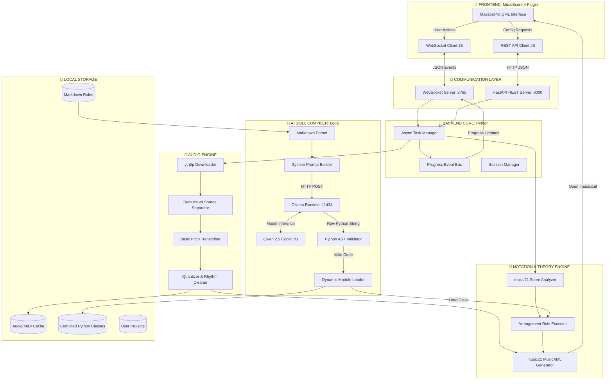
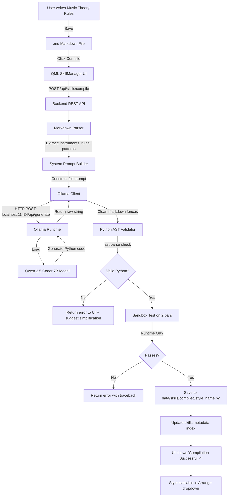

# 🎼 COMPLETE MASTER ARCHITECTURE DOCUMENT
# MaestroPro by Maya Instruments Technology

**Tagline:** *"From Audio to Artistry — AI-Powered Music Notation & Arrangement"*  
**Version:** 2.0.0 (Final Consolidated)  
**Status:** Ready for Implementation  
**Author:** Bagassap / Maya Instruments Technology  

---

## TABLE OF CONTENTS

1. [Executive Summary & Branding](#1-executive-summary--branding)
2. [System Architecture (3 Diagrams)](#2-system-architecture-3-diagrams)
3. [Technology Stack](#3-technology-stack)
4. [Project Directory Structure](#4-project-directory-structure)
5. [Core Workflows](#5-core-workflows)
6. [API & Communication Contracts](#6-api--communication-contracts)
7. [AI Core Specifications (Ollama + Qwen 2.5 Coder)](#7-ai-core-specifications-ollama--qwen-25-coder)
8. [Skill Compiler Deep Dive](#8-skill-compiler-deep-dive)
9. [Audio Engine Deep Dive](#9-audio-engine-deep-dive)
10. [Notation & Theory Engine Deep Dive](#10-notation--theory-engine-deep-dive)
11. [Frontend UI Design (QML)](#11-frontend-ui-design-qml)
12. [Deployment & Packaging Strategy](#12-deployment--packaging-strategy)
13. [Development Roadmap](#13-development-roadmap)
14. [Constraints & Edge Cases](#14-constraints--edge-cases)
15. [Phase 1 File-by-File Specification](#15-phase-1-file-by-file-specification)

---

## 1. EXECUTIVE SUMMARY & BRANDING

### 1.1 Product Vision
**MaestroPro** is a revolutionary, end-to-end desktop application and MuseScore 4 plugin. It bridges the gap between raw audio and professional music notation by leveraging local AI. It allows users to:

- **Transcribe** audio (YouTube/MP3) directly into MuseScore as clean MusicXML notation
- **Analyze** musical structure automatically (Key, Tempo, Chords, Form)
- **Arrange** with custom, theory-accurate instrumentation based on user-defined rules written in simple Markdown
- **Compile** Markdown music theory rules into executable Python code using a local AI (no cloud, no API costs, full privacy)

### 1.2 Brand Identity

| Element | Value |
| :--- | :--- |
| **Product Name** | MaestroPro |
| **Company** | Maya Instruments Technology |
| **Tagline** | "From Audio to Artistry" |
| **Primary Color** | Deep Blue `#1a3a52` |
| **Accent Color** | Gold `#d4af37` |
| **Font (Headings)** | Playfair Display (Serif) |
| **Font (Body)** | Inter (Sans-serif) |
| **Icon Concept** | Stylized treble clef merged with circuit board pattern |

### 1.3 Target Users
- Musicians who want to transcribe songs quickly
- Composers/Arrangers who want AI-assisted orchestration
- Music students studying theory and arrangement
- Producers who need quick notation from audio ideas

---

## 2. SYSTEM ARCHITECTURE (3 DIAGRAMS)

The system uses a **Client-Server Hybrid Architecture**. The UI lives natively inside MuseScore (QML), while heavy computation (Audio AI, Music Theory, LLM Compilation) is handled by a local Python backend. Ollama runs as a separate local process.

### 2.1 Diagram A: Structural Component Diagram



### 2.2 Diagram B: End-to-End Data Flow (Sequence Diagram)

```mermaid
sequenceDiagram
    participant User as User
    participant UI as MuseScore QML
    participant WS as WebSocket :8765
    participant API as FastAPI :8000
    participant Audio as Audio Engine
    participant Notation as Notation Engine
    participant MS as MuseScore Core

    rect rgb(26, 58, 82)
    Note over User,MS: PHASE 1: TRANSCRIPTION
    end
    User->>UI: Paste YouTube URL & Click "Transcribe"
    UI->>WS: {"action":"transcribe","url":"..."}
    WS->>API: Route to Transcription Task
    API->>Audio: Start Pipeline

    loop Real-time Progress
        Audio-->>API: Progress update (e.g. 45%)
        API-->>WS: Push event
        WS-->>UI: Update Progress Bar
    end

    Audio->>Audio: Download (yt-dlp)
    Audio->>Audio: Separate stems (Demucs)
    Audio->>Audio: Transcribe to MIDI (Basic Pitch)
    Audio->>Audio: Quantize rhythm
    Audio->>Notation: Pass quantized MIDI
    Notation->>Notation: Generate .musicxml
    Notation-->>API: Return file path
    API-->>WS: {"status":"complete","file":"score.musicxml"}
    WS-->>UI: Receive completion
    UI->>MS: openScore(filePath)
    MS-->>User: Display transcribed score

    rect rgb(212, 175, 55)
    Note over User,MS: PHASE 2: ARRANGEMENT
    end
    User->>UI: Click "Add Arrangement"
    UI->>UI: Show config dialog (style, instruments)
    User->>UI: Select style & confirm
    UI->>API: POST /api/arrange {style, instruments}
    API->>Notation: Analyze current score
    Notation-->>API: {chords, key, form, tempo}
    API->>API: Dynamic import compiled skill .py
    API->>Notation: Execute arrangement rules
    Notation->>Notation: Merge new parts into score
    Notation-->>API: Return new .musicxml path
    API-->>WS: {"status":"arranged","file":"arranged.musicxml"}
    WS-->>UI: Receive completion
    UI->>MS: openScore(newFilePath)
    MS-->>User: Display final arranged score
```



### 2.3 Diagram C: AI Skill Compiler Flow



---

## 3. TECHNOLOGY STACK

| Layer | Technology | Version | Purpose |
| :--- | :--- | :--- | :--- |
| **Frontend** | QML (Qt 6 / QtQuick) | Qt 6.x | Native MuseScore 4 Plugin UI |
| **Frontend Logic** | JavaScript (ES6) | - | WebSocket client, API calls, UI state |
| **Backend API** | Python | 3.10+ | Core runtime |
| **API Framework** | FastAPI | 0.100+ | REST endpoints, async support |
| **WebSocket** | `websockets` | 12+ | Real-time progress streaming |
| **Audio Download** | `yt-dlp` | Latest | YouTube/URL audio extraction |
| **Source Separation** | `demucs` | 4.x (htdemucs_ft) | Isolate Vocals, Drums, Bass, Other |
| **Audio-to-MIDI** | `basic-pitch` | Latest (Spotify) | Polyphonic MIDI transcription |
| **Music Theory** | `music21` | 9.x | Analysis, manipulation, MusicXML I/O |
| **AI Runtime** | `Ollama` | Latest | Local LLM execution engine |
| **AI Model** | `qwen2.5-coder:7b` | 7B Q4_K_M | Markdown → Python code generation |
| **Code Validation** | Python `ast` | Built-in | Syntax checking of generated code |
| **Packaging** | `PyInstaller` | 6.x | Bundle backend into standalone .exe |
| **HTTP Client** | `requests` | 2.x | Ollama API communication |
| **Audio Processing** | `librosa`, `soundfile` | Latest | Audio format conversion, resampling |

---

## 4. PROJECT DIRECTORY STRUCTURE

```text
maestropro/
│
├── README.md                          # Product overview
├── MASTER_ARCHITECTURE.md             # This document (SSOT)
├── requirements.txt                   # Python dependencies
├── .gitignore                         # Ignore data/, cache/, __pycache__/
│
├── backend/
│   ├── main.py                        # FastAPI + WebSocket entry point
│   ├── config.py                      # Global settings (ports, paths, model)
│   ├── audio_engine/
│   │   ├── __init__.py
│   │   ├── downloader.py              # yt-dlp wrapper
│   │   ├── separator.py              # Demucs integration
│   │   └── transcriber.py            # Basic Pitch + Quantization
│   ├── notation_engine/
│   │   ├── __init__.py
│   │   ├── analyzer.py               # Key, tempo, chord, form detection
│   │   ├── arranger.py               # Applies compiled skills to score
│   │   └── xml_generator.py          # Final MusicXML assembly & export
│   └── skill_compiler/
│       ├── __init__.py
│       ├── parser.py                 # Extract structured rules from .md
│       ├── ollama_client.py          # HTTP client for Ollama API
│       ├── validator.py             # AST syntax + sandbox validation
│       └── loader.py                # Dynamic Python module import
│
├── frontend/
│   └── maestropro/                    # MuseScore Plugin Folder
│       ├── main.qml                   # Main dashboard UI
│       ├── InputPanel.qml            # YouTube URL / MP3 input
│       ├── ProgressPanel.qml         # Real-time progress bar
│       ├── ArrangementDialog.qml     # Style & instrument config
│       ├── SkillManager.qml          # Markdown editor + compile button
│       ├── manifest.json             # MuseScore plugin metadata
│       ├── js/
│       │   ├── websocket_client.js   # WS connection manager
│       │   ├── api_client.js         # REST API helper
│       │   └── score_controller.js   # MuseScore Plugin API wrapper
│       └── assets/
│           ├── logo.png              # MaestroPro logo
│           ├── icon.ico              # App icon
│           └── theme.qml             # Color constants & styles
│
├── data/                              # Runtime data (gitignored)
│   ├── cache/                         # Temporary audio/MIDI files
│   ├── projects/                      # User project workspaces
│   └── skills/
│       ├── markdown/                  # User-written .md rule files
│       ├── compiled/                  # AI-generated .py class files
│       └── metadata.json             # Index of all available skills
│
├── installer/
│   ├── build_windows.spec            # PyInstaller config
│   ├── setup_ollama.ps1             # Auto-install Ollama + pull model
│   └── assets/
│       ├── banner.bmp               # Installer banner
│       └── icon.ico                 # Installer icon
│
├── tests/
│   ├── test_downloader.py
│   ├── test_separator.py
│   ├── test_transcriber.py
│   ├── test_analyzer.py
│   ├── test_compiler.py
│   └── test_validator.py
│
└── docs/
    ├── USER_GUIDE.md
    ├── DEVELOPER_GUIDE.md
    └── MARKDOWN_SYNTAX.md           # How to write skill .md files
```

---

## 5. CORE WORKFLOWS

### 5.1 Workflow A: Smart Transcription (Audio → MusicXML)

```
User Input (YouTube URL / MP3)
  │
  ▼
[1] yt-dlp downloads audio → 16-bit 44.1kHz WAV
  │
  ▼
[2] Demucs (htdemucs_ft) separates into 4 stems:
    ├── vocals.wav    (ignored for notation)
    ├── drums.wav     (optional: rhythm notation)
    ├── bass.wav      → transcribe
    └── other.wav     → transcribe (guitar, piano, etc.)
  │
  ▼
[3] Basic Pitch transcribes bass.wav → bass.mid
    Basic Pitch transcribes other.wav → other.mid
  │
  ▼
[4] Quantizer rounds MIDI note onsets to nearest 1/16 grid
    Removes ghost notes (velocity < threshold)
    Merges overlapping identical pitches
  │
  ▼
[5] music21 reads quantized MIDI
    Assigns correct clefs (bass clef for bass, treble for other)
    Detects key signature
    Generates .musicxml file
  │
  ▼
[6] Backend sends WebSocket event: {"status":"complete","file":"path/to/score.musicxml"}
  │
  ▼
[7] QML receives event → calls MuseScore API: mscore.openScore(filePath)
  │
  ▼
Score appears in MuseScore for user to review and edit
```

### 5.2 Workflow B: Skill Compilation (Markdown → Python)

```
User writes jazz_ballad.md:
  "# Style: Jazz Ballad Strings
   - Instruments: Violin I, Violin II, Viola, Cello
   - Harmony: Convert triads to 7th/9th chords
   - Voice Leading: Max 3rd movement between chords
   - Avoid parallel 5ths and 8ves
   - Cello range: C2 minimum"
  │
  ▼
User clicks "Compile" in SkillManager UI
  │
  ▼
QML sends POST /api/skills/compile with markdown body
  │
  ▼
Backend parser.py extracts structured data:
  {style_name, instruments, harmony_rules, voice_leading_rules, range_rules}
  │
  ▼
ollama_client.py builds prompt with System Prompt + Markdown content
  │
  ▼
HTTP POST to http://localhost:11434/api/generate
  Model: qwen2.5-coder:7b, Temperature: 0.2
  │
  ▼
Qwen generates Python class using music21
  │
  ▼
validator.py runs ast.parse() → syntax check
  │
  ▼
If valid → sandbox test on 2 bars of sample data
  │
  ▼
If passes → save to data/skills/compiled/jazz_ballad.py
  Update metadata.json
  │
  ▼
UI shows "✓ Compilation Successful"
  Style appears in Arrange dropdown
```

### 5.3 Workflow C: Intelligent Arrangement

```
User opens transcribed score in MuseScore
  │
  ▼
User clicks "Add Arrangement" button
  │
  ▼
ArrangementDialog appears:
  - Style: [Jazz Ballad Strings ▼]
  - Instruments: [✓ Violin I] [✓ Violin II] [✓ Viola] [✓ Cello]
  │
  ▼
User confirms → QML sends POST /api/arrange
  │
  ▼
Backend analyzer.py reads current MusicXML:
  → Extracts: key, tempo, time_sig, chord_progression, form, melody_range
  │
  ▼
Backend loader.py dynamically imports jazz_ballad.py
  Instantiates JazzBalladStringsArranger class
  │
  ▼
arranger.py calls class methods:
  → harmonize(chord_progression) → extended chords
  → voice_lead(chords, instruments) → 4-part string writing
  → validate_range(parts) → ensure physical playability
  │
  ▼
New music21.stream.Part objects created for each instrument
  │
  ▼
xml_generator.py merges new parts with original score
  Exports as arranged_score.musicxml
  │
  ▼
WebSocket event → QML → MuseScore opens new score
  │
  ▼
User sees full arrangement with original + new string parts
```

---

## 6. API & COMMUNICATION CONTRACTS

### 6.1 WebSocket Protocol (Port 8765)

**Direction: Frontend → Backend (Commands)**
```json
{
  "type": "command",
  "action": "transcribe",
  "payload": {
    "url": "https://youtube.com/watch?v=...",
    "options": {
      "separate_stems": true,
      "quantize": "1/16"
    }
  }
}
```

**Direction: Backend → Frontend (Events)**
```json
{
  "type": "progress",
  "task_id": "txn_abc123",
  "stage": "source_separation",
  "percent": 45,
  "message": "Isolating instruments using Demucs..."
}
```

```json
{
  "type": "complete",
  "task_id": "txn_abc123",
  "file_path": "C:/MaestroPro/data/projects/song1/score.musicxml"
}
```

```json
{
  "type": "error",
  "task_id": "txn_abc123",
  "stage": "transcription",
  "message": "Basic Pitch failed: audio too short"
}
```

### 6.2 REST API Endpoints (Port 8000)

| Method | Endpoint | Request Body | Response |
| :--- | :--- | :--- | :--- |
| `POST` | `/api/transcribe` | `{"url": "...", "options": {...}}` | `{"task_id": "txn_..."}` |
| `POST` | `/api/analyze` | `{"file_path": "..."}` | `{"key": "G major", "tempo": 120, "chords": [...], "form": [...]}` |
| `POST` | `/api/skills/compile` | `{"name": "jazz_ballad", "markdown": "..."}` | `{"status": "success", "file": "jazz_ballad.py"}` or `{"status": "error", "message": "..."}` |
| `GET` | `/api/skills/list` | - | `{"skills": [{"name": "jazz_ballad", "instruments": [...], "status": "compiled"}]}` |
| `DELETE` | `/api/skills/{name}` | - | `{"status": "deleted"}` |
| `POST` | `/api/arrange` | `{"file_path": "...", "style": "jazz_ballad", "instruments": [...]}` | `{"task_id": "txn_..."}` |
| `GET` | `/api/health` | - | `{"status": "ok", "ollama": true, "model": "qwen2.5-coder:7b"}` |

---

## 7. AI CORE SPECIFICATIONS (OLLAMA + QWEN 2.5 CODER)

### 7.1 Model Configuration

```yaml
Runtime: Ollama
Model: qwen2.5-coder:7b
Quantization: Q4_K_M
File Size: ~4.5 GB
RAM Requirement: 8 GB minimum, 16 GB recommended
Context Window: 32K tokens (used: 4096 for code generation)
API Endpoint: http://localhost:11434/api/generate
```

### 7.2 Generation Parameters

```json
{
  "model": "qwen2.5-coder:7b",
  "temperature": 0.2,
  "top_p": 0.9,
  "num_predict": 4096,
  "num_ctx": 4096,
  "stop": ["```"],
  "keep_alive": "10m"
}
```

**Why these values:**
- `temperature: 0.2` → Low randomness = consistent, deterministic code output
- `top_p: 0.9` → Filters unlikely tokens while maintaining quality
- `num_predict: 4096` → Enough tokens for a complete Python class
- `keep_alive: 10m` → Model stays loaded in RAM for 10 min after last use (faster subsequent calls)

### 7.3 System Prompt (Sent with EVERY compilation request)

```
You are the core AI engine of MaestroPro by Maya Instruments Technology. 
Your task is to convert Markdown music theory rules into a valid, executable 
Python class using the 'music21' library.

STRICT RULES:
1. Output ONLY valid Python code. No markdown formatting, no explanations, 
   no comments outside the code.
2. Class name must be PascalCase matching the style name.
3. Always include these imports at the top:
   from music21 import stream, note, chord, interval, key, meter, pitch
4. Class must include these methods:
   - __init__(self, instruments: list)
   - harmonize(self, chord_progression: list) -> list
   - voice_lead(self, chords: list, instruments: list) -> stream.Score
   - validate_range(self, part: stream.Part, instrument: str) -> bool
5. Use try-except blocks around ALL music21 operations.
6. Implement ALL rules from the Markdown. No placeholders like "pass" or 
   "# TODO" or "# add logic here".
7. If a rule cannot be perfectly implemented in music21, use the closest 
   equivalent and add a Python comment explaining the approximation.
8. Respect physical instrument ranges:
   - Violin: G3 to E7
   - Viola: C3 to A6
   - Cello: C2 to A5
   - Bass: E1 to G4
   - Trumpet: F#3 to D6
   - Trombone: E2 to F5
9. Return only the class definition. No test code, no example usage.
```

### 7.4 Hardware Fallback Strategy

```python
# In config.py
def detect_hardware():
    import psutil
    ram_gb = psutil.virtual_memory().total / (1024**3)
    
    if ram_gb >= 16:
        return {"model": "qwen2.5-coder:14b", "demucs_model": "htdemucs_ft"}
    elif ram_gb >= 8:
        return {"model": "qwen2.5-coder:7b", "demucs_model": "htdemucs_ft"}
    else:
        return {"model": "qwen2.5-coder:1.5b", "demucs_model": "htdemucs"}
```

---

## 8. SKILL COMPILER DEEP DIVE

### 8.1 Markdown Syntax Specification

Users write `.md` files following this structure:

```markdown
# Style: [Style Name]

## Target Instruments
- [Instrument 1]
- [Instrument 2]

## Harmony Rules
- [Rule about chord extensions, substitutions, etc.]

## Voice Leading Rules
- [Rule about interval movement, parallel intervals, etc.]

## Rhythmic Patterns
- [Rule about note durations, syncopation, etc.]

## Range Constraints
- [Any custom range overrides]

## Special Instructions
- [Any additional context for the AI]
```

### 8.2 Example Input → Output

**Input (`bossa_nova_guitar.md`):**
```markdown
# Style: Bossa Nova Guitar Comping

## Target Instruments
- Nylon Guitar

## Harmony Rules
- Use jazz extensions: maj7, min7, dom7, min7b5, dim7
- Add tensions: 9th, 11th, 13th where appropriate
- Use tritone substitution for dominant chords

## Rhythmic Patterns
- Classic bossa nova rhythm: dotted-quarter, eighth, quarter, eighth, quarter
- Anticipate chord changes by one 8th note on beats 2 and 4

## Voice Leading Rules
- Keep voicings within one octave span
- Prefer drop-2 and drop-3 voicings
- Smooth voice leading: max movement of a major 3rd per voice
```

**Output (`bossa_nova_guitar.py`):**
```python
from music21 import stream, note, chord, interval, key, meter, pitch

class BossaNovaGuitarComping:
    def __init__(self, instruments=None):
        self.instruments = instruments or ["Nylon Guitar"]
        self.guitar_range = ("E3", "E6")
    
    def harmonize(self, chord_progression):
        extended_chords = []
        for c in chord_progression:
            try:
                if c.isDominant():
                    # Add 9th and 13th tensions
                    pitches = list(c.pitches)
                    root = pitches[0]
                    pitches.append(root.transpose(14))  # 9th
                    pitches.append(root.transpose(21))  # 13th
                    extended_chords.append(chord.Chord(pitches))
                elif c.isMajorTriad():
                    pitches = list(c.pitches)
                    pitches.append(pitches[0].transpose(11))  # maj7
                    extended_chords.append(chord.Chord(pitches))
                else:
                    extended_chords.append(c)
            except Exception:
                extended_chords.append(c)
        return extended_chords
    
    def voice_lead(self, chords, instruments):
        score = stream.Score()
        guitar_part = stream.Part()
        bossa_rhythm = [1.5, 0.5, 1.0, 0.5, 1.0]  # in quarter notes
        beat_pos = 0.0
        for ch in chords:
            try:
                # Drop-2 voicing
                pitches = sorted(ch.pitches, key=lambda p: p.ps)
                if len(pitches) >= 4:
                    pitches[-2] = pitches[-2].transpose(-12)
                voicing = chord.Chord(pitches)
                for dur in bossa_rhythm:
                    n = note.Note()
                    n.duration.quarterLength = dur
                    n.pitch = pitches[0]
                    guitar_part.append(voicing)
                    beat_pos += dur
            except Exception:
                continue
        score.append(guitar_part)
        return score
    
    def validate_range(self, part, instrument):
        try:
            for n in part.recurse().notes:
                if isinstance(n, note.Note):
                    if n.pitch.ps < pitch.Pitch("E3").ps:
                        return False
                    if n.pitch.ps > pitch.Pitch("E6").ps:
                        return False
            return True
        except Exception:
            return False
```

### 8.3 Validation Pipeline

```python
# validator.py
import ast
import traceback

def validate_syntax(code_string: str) -> tuple[bool, str]:
    """Check if generated code is valid Python"""
    try:
        ast.parse(code_string)
        return True, "Syntax OK"
    except SyntaxError as e:
        return False, f"Syntax Error at line {e.lineno}: {e.msg}"

def validate_imports(code_string: str) -> tuple[bool, str]:
    """Ensure code only imports allowed modules"""
    allowed = {"music21", "typing", "math", "random"}
    try:
        tree = ast.parse(code_string)
        for node in ast.walk(tree):
            if isinstance(node, ast.Import):
                for alias in node.names:
                    if alias.name.split(".")[0] not in allowed:
                        return False, f"Disallowed import: {alias.name}"
            elif isinstance(node, ast.ImportFrom):
                if node.module and node.module.split(".")[0] not in allowed:
                    return False, f"Disallowed import: {node.module}"
        return True, "Imports OK"
    except Exception as e:
        return False, str(e)
```

### 8.4 Dynamic Module Loader

```python
# loader.py
import importlib.util
import sys
from pathlib import Path

def load_skill_class(skill_name: str, skills_dir: str = "data/skills/compiled"):
    file_path = Path(skills_dir) / f"{skill_name}.py"
    if not file_path.exists():
        raise FileNotFoundError(f"Skill not found: {file_path}")
    
    module_name = f"maestropro_skill_{skill_name}"
    spec = importlib.util.spec_from_file_location(module_name, file_path)
    module = importlib.util.module_from_spec(spec)
    sys.modules[module_name] = module
    spec.loader.exec_module(module)
    
    # Find the class (PascalCase version of skill_name)
    class_name = skill_name.replace("_", " ").title().replace(" ", "")
    arranger_class = getattr(module, class_name, None)
    if arranger_class is None:
        # Fallback: find first class in module
        for attr_name in dir(module):
            attr = getattr(module, attr_name)
            if isinstance(attr, type) and attr_name != "object":
                arranger_class = attr
                break
    
    if arranger_class is None:
        raise ValueError(f"No class found in {file_path}")
    
    return arranger_class
```

---

## 9. AUDIO ENGINE DEEP DIVE

### 9.1 Downloader (`downloader.py`)

```python
import yt_dlp
import os

def download_audio(url: str, output_dir: str) -> str:
    """Download audio from YouTube URL as 16-bit 44.1kHz WAV"""
    output_path = os.path.join(output_dir, "raw_audio.%(ext)s")
    ydl_opts = {
        'format': 'bestaudio/best',
        'postprocessors': [{
            'key': 'FFmpegExtractAudio',
            'preferredcodec': 'wav',
            'preferredquality': '16',
        }],
        'outtmpl': output_path,
        'quiet': True,
    }
    with yt_dlp.YoutubeDL(ydl_opts) as ydl:
        info = ydl.extract_info(url, download=True)
        wav_path = os.path.join(output_dir, "raw_audio.wav")
        return wav_path
```

### 9.2 Separator (`separator.py`)

```python
import demucs.separate
import os

def separate_stems(audio_path: str, output_dir: str, model: str = "htdemucs_ft"):
    """Separate audio into vocals, drums, bass, other"""
    demucs.separate.main([
        "--two-stems", "none",
        "-n", model,
        "-o", output_dir,
        audio_path
    ])
    # Output: output_dir/htdemucs_ft/raw_audio/{vocals,drums,bass,other}.wav
    stems_dir = os.path.join(output_dir, model, "raw_audio")
    return {
        "vocals": os.path.join(stems_dir, "vocals.wav"),
        "drums": os.path.join(stems_dir, "drums.wav"),
        "bass": os.path.join(stems_dir, "bass.wav"),
        "other": os.path.join(stems_dir, "other.wav"),
    }
```

### 9.3 Transcriber (`transcriber.py`)

```python
from basic_pitch.inference import predict
from basic_pitch import ICASSP_2022_MODEL_PATH
import pretty_midi

def transcribe_to_midi(audio_path: str, output_midi_path: str):
    """Transcribe audio to MIDI using Basic Pitch"""
    model_output, midi_data, note_events = predict(audio_path)
    midi_data.write(output_midi_path)
    return output_midi_path

def quantize_midi(midi_path: str, output_path: str, grid: str = "1/16"):
    """Snap note onsets to nearest rhythmic grid"""
    midi = pretty_midi.PrettyMIDI(midi_path)
    grid_map = {"1/8": 0.5, "1/16": 0.25, "1/32": 0.125}
    grid_val = grid_map.get(grid, 0.25)
    
    for instrument in midi.instruments:
        for note in instrument.notes:
            note.start = round(note.start / grid_val) * grid_val
            note.end = round(note.end / grid_val) * grid_val
            # Remove ghost notes
            if note.velocity < 20:
                instrument.notes.remove(note)
    
    midi.write(output_path)
    return output_path
```

---

## 10. NOTATION & THEORY ENGINE DEEP DIVE

### 10.1 Analyzer (`analyzer.py`)

```python
from music21 import converter, analysis

def analyze_score(musicxml_path: str) -> dict:
    """Analyze a MusicXML file for musical structure"""
    score = converter.parse(musicxml_path)
    
    # Key detection
    key_analysis = score.analyze('key')
    
    # Tempo
    tempo = score.metronomeMarkBoundaries()[0][2].number if score.metronomeMarkBoundaries() else 120
    
    # Time signature
    ts = score.getTimeSignatures()[0] if score.getTimeSignatures() else None
    
    # Chord analysis (Roman numerals)
    chords = score.chordify()
    roman_numerals = []
    for c in chords.recurse().getElementsByClass('Chord'):
        try:
            rn = analysis.roman.romanNumeralFromChord(c, key_analysis)
            roman_numerals.append(rn.figure)
        except:
            roman_numerals.append("?")
    
    return {
        "key": str(key_analysis),
        "tempo": tempo,
        "time_signature": str(ts) if ts else "4/4",
        "chord_progression": roman_numerals,
        "duration": score.duration.quarterLength
    }
```

### 10.2 MusicXML Generator (`xml_generator.py`)

```python
from music21 import stream, converter

def merge_and_export(original_path: str, new_parts: list, output_path: str):
    """Merge new arrangement parts with original score and export"""
    score = converter.parse(original_path)
    
    for part in new_parts:
        score.append(part)
    
    score.write('musicxml', fp=output_path)
    return output_path
```

---

## 11. FRONTEND UI DESIGN (QML)

### 11.1 Theme Constants (`theme.qml`)

```qml
pragma Singleton
import QtQuick

QtObject {
    readonly property color primary: "#1a3a52"
    readonly property color accent: "#d4af37"
    readonly property color bgDark: "#0d1b2a"
    readonly property color bgCard: "#1b2838"
    readonly property color textPrimary: "#ffffff"
    readonly property color textSecondary: "#a0aec0"
    readonly property color success: "#48bb78"
    readonly property color error: "#fc8181"
    readonly property int borderRadius: 8
}
```

### 11.2 Main Dashboard Layout (`main.qml`)

```
┌─────────────────────────────────────────────────────┐
│ 🎼 MaestroPro                          [?] [⚙] [✕] │
│    Maya Instruments Technology                      │
├─────────────────────────────────────────────────────┤
│                                                     │
│  ┌─ 📥 TRANSCRIBE ───────────────────────────────┐ │
│  │ YouTube URL: [________________________] [Go]  │ │
│  │ or [Browse MP3 File]                          │ │
│  │ Progress: ████████████░░░░ 75%                │ │
│  │ Status: Separating instruments...             │ │
│  └───────────────────────────────────────────────┘ │
│                                                     │
│  ┌─ 🎯 ANALYZE ─────────────────────────────────┐ │
│  │ [Analyze Current Score]                       │ │
│  │ Key: G Major | Tempo: 120 | Form: V-C-B-C    │ │
│  └───────────────────────────────────────────────┘ │
│                                                     │
│  ┌─ 🎨 ARRANGE ─────────────────────────────────┐ │
│  │ Style: [Jazz Ballad Strings ▼]               │ │
│  │ [✓ Violin I] [✓ Viola] [✓ Cello]             │ │
│  │ [Add Arrangement]                             │ │
│  └───────────────────────────────────────────────┘ │
│                                                     │
│  ┌─ 📝 SKILL MANAGER ──────────────────────────┐ │
│  │ [New] [Edit] [Compile] [Delete]              │ │
│  │ • jazz_ballad_strings.md ✓                   │ │
│  │ • bossa_nova_guitar.md ✓                     │ │
│  └───────────────────────────────────────────────┘ │
│                                                     │
└─────────────────────────────────────────────────────┘
```

### 11.3 manifest.json

```json
{
  "name": "MaestroPro",
  "description": "AI-Powered Music Transcription & Arrangement by Maya Instruments Technology",
  "version": "1.0.0",
  "author": "Maya Instruments Technology",
  "main": "main.qml",
  "type": "dock",
  "requiresScore": false
}
```

---

## 12. DEPLOYMENT & PACKAGING STRATEGY

### 12.1 Installer Contents

```
MaestroPro-Setup-v1.0.0.exe
├── Bundled Ollama Runtime (~100MB)
├── Pre-downloaded Qwen 2.5 Coder 7B model (~4.5GB)
├── maestropro-backend.exe (PyInstaller bundle)
├── MuseScore Plugin folder (QML files)
└── Auto-setup scripts
```

### 12.2 Installation Flow

```
1. User runs MaestroPro-Setup.exe
2. Installer checks for MuseScore 4 installation
3. Copies QML plugin to Documents/MuseScore4/Plugins/maestropro/
4. Installs Ollama silently
5. Starts Ollama service
6. Copies pre-bundled model to Ollama models directory
7. Creates Start Menu shortcut for MaestroPro Backend
8. Backend starts in system tray, listening on :8000 and :8765
9. User opens MuseScore → MaestroPro appears in Plugins menu
```

### 12.3 Ollama Auto-Setup Script (`setup_ollama.ps1`)

```powershell
Write-Host "=== MaestroPro AI Setup ===" -ForegroundColor Cyan

# Check if Ollama is installed
if (!(Get-Command ollama -ErrorAction SilentlyContinue)) {
    Write-Host "Installing Ollama..."
    Invoke-WebRequest -Uri "https://ollama.ai/download/OllamaSetup.exe" -OutFile "$env:TEMP\OllamaSetup.exe"
    Start-Process -FilePath "$env:TEMP\OllamaSetup.exe" -ArgumentList "/S" -Wait
}

# Start Ollama
Start-Process -FilePath "ollama" -ArgumentList "serve" -WindowStyle Hidden
Start-Sleep -Seconds 5

# Pull model
Write-Host "Setting up Qwen 2.5 Coder model..."
ollama pull qwen2.5-coder:7b

Write-Host "AI Engine ready!" -ForegroundColor Green
```

---

## 13. DEVELOPMENT ROADMAP

| Phase | Duration | Deliverables | Key Files |
| :--- | :--- | :--- | :--- |
| **Phase 1: Foundation** | Week 1-2 | Repo setup, WebSocket bridge, QML skeleton, FastAPI server, echo test | `main.py`, `main.qml`, `websocket_client.js`, `config.py` |
| **Phase 2: Transcription MVP** | Week 3-5 | Full audio pipeline: YouTube → Demucs → Basic Pitch → MusicXML → MuseScore | `downloader.py`, `separator.py`, `transcriber.py`, `xml_generator.py` |
| **Phase 3: AI Skill Compiler** | Week 6-8 | Markdown parser, Ollama client, AST validator, dynamic loader, Skill Manager UI | `parser.py`, `ollama_client.py`, `validator.py`, `loader.py`, `SkillManager.qml` |
| **Phase 4: Arrangement Engine** | Week 9-11 | Score analyzer, arrangement executor, 3-5 built-in styles, ArrangementDialog UI | `analyzer.py`, `arranger.py`, `ArrangementDialog.qml` |
| **Phase 5: Polish & Package** | Week 12-14 | UI theming, error handling, PyInstaller packaging, Ollama auto-setup, docs | `theme.qml`, `build_windows.spec`, `setup_ollama.ps1`, `USER_GUIDE.md` |

---

## 14. CONSTRAINTS & EDGE CASES

| # | Issue | Mitigation |
| :--- | :--- | :--- |
| 1 | **AI hallucinates invalid Python** | Mandatory `ast.parse()` validation + sandbox test on 2 bars before saving |
| 2 | **RAM < 8GB** | Auto-detect hardware, downgrade to `qwen2.5-coder:1.5b` + `htdemucs` (lighter) |
| 3 | **Complex polyphony transcription errors** | Provide "Quantize & Clean" tool in UI; document realistic expectations |
| 4 | **MuseScore API is slow for note-by-note writing** | Architecture bypasses this: Python generates final `.musicxml`, MuseScore just opens it |
| 5 | **Ollama not running** | Backend `/api/health` checks Ollama status; UI shows warning if offline |
| 6 | **YouTube download fails (geo-block, private)** | Error handling in `downloader.py` with user-friendly message; support local MP3 fallback |
| 7 | **Generated code imports dangerous modules** | `validator.py` checks all imports against allowlist (`music21`, `typing`, `math`, `random`) |
| 8 | **Large audio files (>30 min)** | Chunk processing in transcriber; progress updates per chunk |
| 9 | **Port conflicts (8765/8000/11434)** | Config file allows custom ports; auto-detect available ports on startup |
| 10 | **User writes ambiguous Markdown** | System prompt instructs AI to use closest `music21` equivalent + comment; validator catches syntax issues |

---

## 15. PHASE 1 FILE-BY-FILE SPECIFICATION

### 15.1 `requirements.txt`
```
fastapi>=0.100.0
uvicorn>=0.23.0
websockets>=12.0
requests>=2.31.0
yt-dlp>=2024.1.0
demucs>=4.0.0
basic-pitch>=0.4.0
music21>=9.0.0
pretty-midi>=0.2.10
librosa>=0.10.0
soundfile>=0.12.0
psutil>=5.9.0
pydantic>=2.0.0
```

### 15.2 `backend/config.py`
```python
import os
from pathlib import Path

APP_NAME = "MaestroPro"
COMPANY = "Maya Instruments Technology"
VERSION = "1.0.0"

# Ports
WS_PORT = 8765
REST_PORT = 8000
OLLAMA_PORT = 11434

# Paths
BASE_DIR = Path.home() / "MaestroPro"
DATA_DIR = BASE_DIR / "data"
CACHE_DIR = DATA_DIR / "cache"
SKILLS_MD_DIR = DATA_DIR / "skills" / "markdown"
SKILLS_PY_DIR = DATA_DIR / "skills" / "compiled"
PROJECTS_DIR = DATA_DIR / "projects"

# AI
OLLAMA_URL = f"http://localhost:{OLLAMA_PORT}"
DEFAULT_MODEL = "qwen2.5-coder:7b"
TEMPERATURE = 0.2

# Create directories
for d in [CACHE_DIR, SKILLS_MD_DIR, SKILLS_PY_DIR, PROJECTS_DIR]:
    d.mkdir(parents=True, exist_ok=True)
```

### 15.3 `backend/main.py` (Skeleton)
```python
from fastapi import FastAPI, WebSocket
from contextlib import asynccontextmanager
import asyncio
import json
from config import APP_NAME, VERSION, REST_PORT

@asynccontextmanager
async def lifespan(app: FastAPI):
    print(f"🎼 {APP_NAME} v{VERSION} Backend Starting...")
    yield
    print(f"🎼 {APP_NAME} Backend Shutting Down...")

app = FastAPI(title=APP_NAME, version=VERSION, lifespan=lifespan)

# WebSocket endpoint for real-time progress
@app.websocket("/ws")
async def websocket_endpoint(websocket: WebSocket):
    await websocket.accept()
    try:
        while True:
            data = await websocket.receive_text()
            msg = json.loads(data)
            # Route to appropriate handler
            await websocket.send_text(json.dumps({
                "type": "echo",
                "message": f"Received: {msg.get('action')}"
            }))
    except Exception:
        pass

# REST endpoints
@app.get("/api/health")
async def health_check():
    return {"status": "ok", "app": APP_NAME, "version": VERSION}

if __name__ == "__main__":
    import uvicorn
    uvicorn.run(app, host="0.0.0.0", port=REST_PORT)
```

### 15.4 `frontend/maestropro/main.qml` (Skeleton)
```qml
import QtQuick 2.15
import QtQuick.Controls 2.15
import QtQuick.Layouts 1.15

Rectangle {
    id: root
    width: 400
    height: 600
    color: "#0d1b2a"

    ColumnLayout {
        anchors.fill: parent
        anchors.margins: 16
        spacing: 12

        // Header
        Label {
            text: "🎼 MaestroPro"
            font.pixelSize: 24
            font.bold: true
            color: "#d4af37"
        }
        Label {
            text: "Maya Instruments Technology"
            font.pixelSize: 12
            color: "#a0aec0"
        }

        // Transcribe Section
        Rectangle {
            Layout.fillWidth: true
            height: 120
            color: "#1b2838"
            radius: 8
            // Input field + button placeholder
        }

        // Analyze Section
        Rectangle {
            Layout.fillWidth: true
            height: 80
            color: "#1b2838"
            radius: 8
        }

        // Arrange Section
        Rectangle {
            Layout.fillWidth: true
            height: 120
            color: "#1b2838"
            radius: 8
        }

        // Skill Manager Section
        Rectangle {
            Layout.fillWidth: true
            Layout.fillHeight: true
            color: "#1b2838"
            radius: 8
        }
    }
}
```

---

## 🚀 HOW TO USE THIS DOCUMENT WITH QWEN CODER

1. Copy this **entire document** (all 15 sections).
2. Open [https://coder.qwen.ai/](https://coder.qwen.ai/).
3. Create a new project named `maestropro`.
4. Paste this document into the chat with the following instruction:

> *"Qwen, this is the complete MASTER_ARCHITECTURE.md for MaestroPro by Maya Instruments Technology. Read and internalize every section — the architecture, all 3 diagrams, tech stack, workflows, API contracts, AI specifications, code examples, and roadmap. This is your single source of truth. Acknowledge that you understand the full system, then begin Phase 1: generate requirements.txt, backend/config.py, backend/main.py, and frontend/maestropro/main.qml exactly as specified in Section 15."*

---

**End of Document**  
*© 2026 Maya Instruments Technology. All rights reserved.*  
*MaestroPro — From Audio to Artistry* 🎼✨
