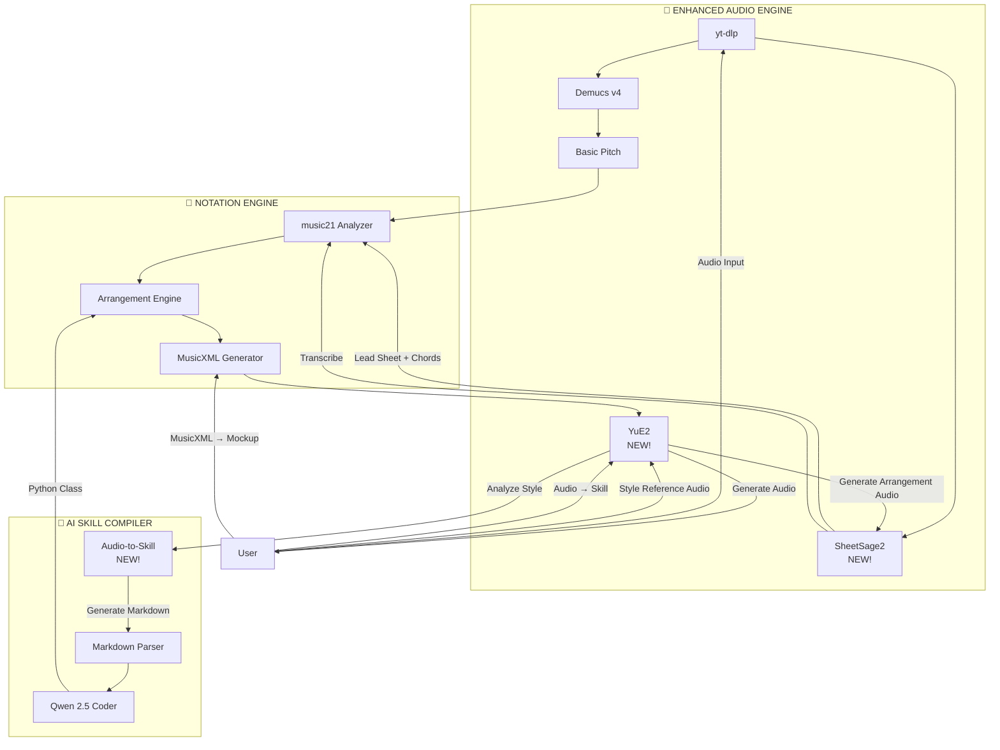

# 🚀 Integrasi SheetSage2 & YuE2 ke MaestroPro

Pertanyaan yang sangat strategis! SheetSage2 dan YuE2 bisa menjadi **"power-up"** yang signifikan untuk MaestroPro, terutama di **Layer 1 (AI Input)** dan membuka workflow baru yang sebelumnya tidak mungkin.

---

## 📚 Apa Itu SheetSage2 & YuE2?

### **SheetSage2** (MIT/UC Berkeley)
- **Fungsi:** Audio → Lead Sheet (Melody + Chord Symbols)
- **Keunggulan:** Akurasi tinggi untuk transkripsi polifonik, langsung output chord symbols (`Cmaj7`, `Dm7`, dll)
- **Output:** ABC Notation / MIDI dengan chord annotations
- **Kekuatan:** Jauh lebih baik dari Basic Pitch untuk **full mix transcription**

### **YuE2** (NetEase)
- **Fungsi:** Text/Audio Prompt → Full Song Generation
- **Keunggulan:** Zero-shot generation, bisa generate lagu lengkap dengan vokal, aransemen, produksi
- **Output:** Audio file (WAV/MP3)
- **Kekuatan:** "Creative partner" yang bisa generate aransemen dari deskripsi tekstual

---

## 🎯 Di Mana Mereka Meningkatkan MaestroPro?

### **1. SheetSage2 → Upgrade Audio Engine (Transcription)**

**Current MaestroPro:**
```
Audio → Demucs (separate stems) → Basic Pitch (per stem) → MIDI → MusicXML
```

**With SheetSage2:**
```
Audio → SheetSage2 (direct lead sheet) → Chord Symbols + Melody → MusicXML
```

**Benefit:**
- ✅ **Lebih cepat:** Skip Demucs separation (SheetSage2 handle full mix)
- ✅ **Chord symbols langsung dapat:** Tidak perlu analyze chord dari MIDI lagi
- ✅ **Lebih akurat untuk lead sheet:** SheetSage2 dilatih khusus untuk ini
- ✅ **Fallback option:** Jika Basic Pitch gagal di stem tertentu, SheetSage2 bisa jadi backup

**Implementasi:**
```python
# backend/audio_engine/transcriber.py (enhanced)

def transcribe_lead_sheet(audio_path: str, output_dir: str):
    """Use SheetSage2 for direct lead sheet extraction"""
    # SheetSage2 API call
    result = sheetsage2.transcribe(audio_path)
    
    # Output: melody.mid + chords.json
    melody_midi = result['melody']
    chords = result['chords']  # ["Cmaj7", "Dm7", "G7", "Cmaj7"]
    
    return melody_midi, chords
```

---

### **2. YuE2 → Arrangement Generator & Style Reference**

Ini membuka **workflow baru yang revolutionary**:

#### **Workflow A: "Audio-First Arrangement"**
```
User: "Buatkan aransemen string section seperti lagu 'Yesterday' Beatles"
  ↓
YuE2: Generate audio aransemen string (reference)
  ↓
SheetSage2: Transkripsi audio YuE2 → lead sheet
  ↓
MaestroPro: Convert ke MusicXML → Apply ke score user
  ↓
User: Review & edit di MuseScore
```

**Benefit:**
- ✅ **User tidak perlu jago teori:** Cukup kasih referensi audio, AI yang transkripsi
- ✅ **Style matching:** YuE2 bisa capture "feel" dari lagu referensi
- ✅ **Rapid prototyping:** Generate 5 variasi aransemen dalam hitungan menit

#### **Workflow B: "Arrangement Mockup"**
```
User sudah punya MusicXML aransemen
  ↓
User: "Generate audio mockup untuk dengarkan"
  ↓
YuE2: Convert MusicXML → audio dengan virtual instruments realistis
  ↓
User: Dengarkan → approve/reject → edit jika perlu
```

**Benefit:**
- ✅ **Pre-print validation:** Dengarkan aransemen sebelum print partitur
- ✅ **Client presentation:** Tunjukkan mockup audio ke klien sebelum finalisasi
- ✅ **Iterasi cepat:** Edit MusicXML → regenerate audio → dengarkan lagi

---

### **3. YuE2 + Skill Compiler → "Style Learning from Audio"**

**Current Skill Compiler:**
```
User tulis markdown rules → Qwen compile → Python class
```

**With YuE2:**
```
User: "Saya mau style seperti lagu ini" + upload audio referensi
  ↓
YuE2: Analyze style (tempo, instrumentation, harmony, rhythm patterns)
  ↓
Auto-generate markdown rules dari analisis YuE2
  ↓
Qwen compile markdown → Python class
  ↓
Skill baru siap pakai!
```

**Benefit:**
- ✅ **Zero-effort skill creation:** Tidak perlu tulis markdown manual
- ✅ **Style cloning:** Clone style dari lagu favorit
- ✅ **Continuous learning:** Setiap lagu referensi = skill baru

**Implementasi:**
```python
# backend/skill_compiler/audio_to_skill.py

def generate_skill_from_audio(audio_path: str, skill_name: str):
    """Use YuE2 to analyze audio and generate markdown rules"""
    
    # YuE2 analyze style
    analysis = yue2.analyze_style(audio_path)
    
    # Extract: tempo, key, instrumentation, chord patterns, rhythm
    markdown = f"""
# Style: {skill_name}

## Tempo & Feel
- BPM: {analysis['tempo']}
- Feel: {analysis['groove']}

## Instrumentation
{format_instruments(analysis['instruments'])}

## Harmony Rules
{format_harmony(analysis['chord_patterns'])}

## Rhythmic Patterns
{format_rhythm(analysis['rhythm'])}
"""
    
    # Save markdown
    save_markdown(skill_name, markdown)
    
    # Compile to Python
    compile_markdown_to_python(skill_name, markdown)
```

---

### **4. SheetSage2 + YuE2 → "Reverse Engineering Workflow"**

**Workflow baru yang powerful:**
```
User: Upload audio lagu favorit
  ↓
SheetSage2: Transkripsi → lead sheet (melody + chords)
  ↓
User: "Buatkan aransemen seperti ini tapi untuk string quartet"
  ↓
YuE2: Generate aransemen string quartet berdasarkan lead sheet
  ↓
SheetSage2: Transkripsi aransemen YuE2 → MusicXML
  ↓
MaestroPro: Validate dengan theory rules → export print-ready MusicXML
```

**Benefit:**
- ✅ **Reverse engineering:** Pelajari aransemen lagu favorit
- ✅ **Style transfer:** Ambil struktur lagu A, apply style lagu B
- ✅ **Educational tool:** Mahasiswa bisa analyze aransemen profesional

---

### **5. Full Orchestration Workflow (SheetSage2 + YuE2 + Human-in-the-Loop)**

Workflow end-to-end untuk mengaransemen lagu dari nol hingga preview audio:

```
[1] Insert lagu yang ingin diaransemen
    User upload audio / paste URL YouTube lagu yang ingin diaransemen
  ↓
[2] Konfigurasi aransemen yang diinginkan
    Pilih genre, target instrumen, jumlah part, key, tempo, dll
    (contoh: "String Orchestra — Violin I/II, Viola, Cello, Contrabass")
  ↓
[3] SheetSage2 transkrip ke masing-masing instrumen
    SheetSage2 melakukan transkripsi lead sheet (melody + chords)
    → hasil dipecah menjadi part per instrumen sesuai konfigurasi
    → output: MusicXML multi-part
  ↓
[4] User edit aransemen sesuai keinginan
    User mengedit aransemen langsung di MuseScore
    (tambah/hapus not, ubah voicing, sesuaikan dinamika, dll)
  ↓
[5] YuE2 preview hasil orkestrasi
    YuE2 mengubah MusicXML hasil edit → audio mockup realistis
    User mendengarkan hasil orkestrasi sebelum finalisasi
  ↓
[6] Iterasi (opsional)
    Dengarkan → edit lagi di MuseScore → regenerate preview → ulang
    hingga hasil sesuai keinginan → export print-ready MusicXML
```

**Benefit:**
- ✅ **Human-in-the-loop:** AI membantu transkripsi & preview, user tetap kreatif mengedit
- ✅ **Per-instrument transcription:** SheetSage2 memecah lead sheet menjadi part per instrumen sesuai konfigurasi
- ✅ **Audio feedback real-time:** YuE2 memberikan preview orkestrasi sebelum cetak partitur
- ✅ **Iterasi cepat:** Edit → preview → edit lagi tanpa perlu render manual

**Implementasi endpoint:**
```python
# backend/main.py

@app.post("/api/orchestrate/transcribe")
async def orchestrate_transcribe(audio_path: str, config: ArrangementConfig):
    """SheetSage2: transcribe lagu → multi-part MusicXML sesuai konfigurasi"""
    melody, chords = sheetsage2.transcribe(audio_path)
    parts = split_into_instruments(melody, chords, config.instruments)
    musicxml_path = export_musicxml_multi_part(parts)
    return {"file_path": musicxml_path, "instruments": config.instruments}

@app.post("/api/orchestrate/preview")
async def orchestrate_preview(musicxml_path: str):
    """YuE2: generate audio mockup dari MusicXML hasil edit user"""
    audio_path = yue2.musicxml_to_audio(musicxml_path)
    return {"audio_path": audio_path}
```

---

## 📊 Perbandingan: Before vs After Integration

| Fitur | MaestroPro Current | + SheetSage2 | + YuE2 | + Both |
| :--- | :--- | :--- | :--- | :--- |
| **Transcription Speed** | ⭐⭐⭐ (Demucs + Basic Pitch) | ⭐⭐⭐⭐⭐ (Direct lead sheet) | ⭐⭐⭐ | ⭐⭐⭐⭐⭐ |
| **Chord Detection** | ⭐⭐⭐ (music21 analysis) | ⭐⭐⭐⭐⭐ (Built-in) | ⭐⭐⭐ | ⭐⭐⭐⭐⭐ |
| **Arrangement Generation** | ⭐⭐ (Rule-based only) | ⭐⭐ | ⭐⭐⭐⭐⭐ (Audio generation) | ⭐⭐⭐⭐⭐ |
| **Style Learning** | ⭐⭐ (Manual markdown) | ⭐⭐ | ⭐⭐⭐⭐⭐ (Audio → skill) | ⭐⭐⭐⭐⭐ |
| **Mockup Audio** | ❌ None | ❌ None | ⭐⭐⭐⭐⭐ (Audio mockup) | ⭐⭐⭐⭐⭐ |
| **Reverse Engineering** | ❌ None | ⭐⭐⭐⭐ (Transcription) | ⭐⭐⭐⭐ (Generation) | ⭐⭐⭐⭐⭐ |

---

## 🏗️ Updated Architecture dengan SheetSage2 & YuE2



---

## 🎯 Concrete Integration Points

### **1. New Endpoint: `/api/transcribe/lead-sheet`**
```python
# backend/main.py

@app.post("/api/transcribe/lead-sheet")
async def transcribe_lead_sheet(url: str):
    """Use SheetSage2 for direct lead sheet extraction"""
    audio_path = download_audio(url)
    melody, chords = sheetsage2.transcribe(audio_path)
    musicxml_path = convert_to_musicxml(melody, chords)
    return {"file_path": musicxml_path, "chords": chords}
```

### **2. New Endpoint: `/api/generate/arrangement`**
```python
@app.post("/api/generate/arrangement")
async def generate_arrangement(style_reference: str, lead_sheet_path: str):
    """Use YuE2 to generate arrangement from style reference"""
    arrangement_audio = yue2.generate(style_reference, lead_sheet_path)
    melody, chords = sheetsage2.transcribe(arrangement_audio)
    musicxml_path = convert_to_musicxml(melody, chords)
    return {"file_path": musicxml_path}
```

### **3. New Endpoint: `/api/skills/from-audio`**
```python
@app.post("/api/skills/from-audio")
async def create_skill_from_audio(audio_path: str, skill_name: str):
    """Use YuE2 to analyze audio and create skill"""
    analysis = yue2.analyze_style(audio_path)
    markdown = generate_markdown_from_analysis(analysis, skill_name)
    compile_markdown_to_python(skill_name, markdown)
    return {"status": "success", "skill": skill_name}
```

### **4. New Endpoint: `/api/mockup/generate`**
```python
@app.post("/api/mockup/generate")
async def generate_mockup(musicxml_path: str):
    """Use YuE2 to generate audio mockup from MusicXML"""
    audio_path = yue2.musicxml_to_audio(musicxml_path)
    return {"audio_path": audio_path}
```

---

## 💡 Strategic Recommendations

### **Phase 1: Integrate SheetSage2 (High Priority)**
- **Why:** Direct improvement to transcription quality
- **Effort:** Medium (replace Basic Pitch with SheetSage2 for lead sheet)
- **Impact:** ⭐⭐⭐⭐⭐

### **Phase 2: Integrate YuE2 for Mockup (Medium Priority)**
- **Why:** Unique selling point — dengarkan aransemen sebelum print
- **Effort:** High (YuE2 API integration)
- **Impact:** ⭐⭐⭐⭐

### **Phase 3: YuE2 for Arrangement Generation (Nice-to-Have)**
- **Why:** Revolutionary workflow, tapi kompleks
- **Effort:** Very High
- **Impact:** ⭐⭐⭐⭐⭐

### **Phase 4: Audio-to-Skill (Experimental)**
- **Why:** Advanced feature untuk power users
- **Effort:** Very High
- **Impact:** ⭐⭐⭐

---

## 🎨 Updated Positioning

Dengan integrasi ini, positioning MaestroPro menjadi:

> **"MaestroPro: The Ultimate Hybrid Music Workbench"**
> - AI-Powered Transcription (SheetSage2 + Basic Pitch)
> - AI-Generated Arrangements (YuE2)
> - Theory-Driven Validation (music21)
> - Print-Ready Output (MusicXML)
> - Audio Mockup Generation (YuE2)

**Tagline baru:**
> **"From Audio to Artistry — Powered by AI, Perfected by Theory"**

---

## 🚀 Next Steps

Mau kita mulai dari mana?

**A.** Update `MASTER_ARCHITECTURE.md` dengan integrasi SheetSage2 & YuE2

**B.** Buat prototype integrasi SheetSage2 (upgrade transcription engine)

**C.** Buat prototype integrasi YuE2 (mockup generation)

**D.** Buat demo workflow lengkap: Audio → SheetSage2 → YuE2 → MusicXML → Mockup

Pilih salah satu, dan kita eksekusi! 🎼✨